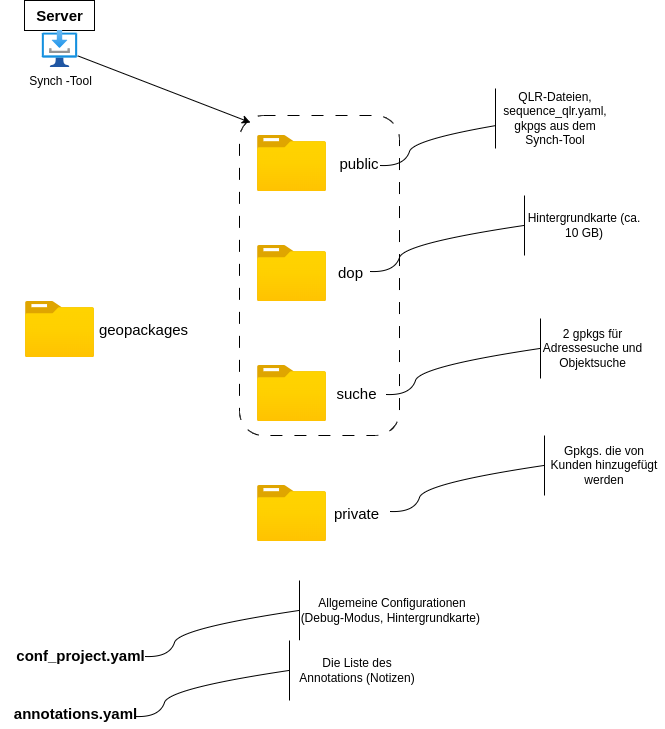

# Profile MoFa4Q

MoFa4Q is an abbreviation of "Mobile-Fachschale-QGIS" (mobile application for QGIS). 
This repo contains only the profile. Its installer can be found at Repo https://github.com/WhereGroup/qgis_mofa4q_installer.

## Features
- Designed for offline use
- Reduced QGIS interface and optimized for tablet use, but can also be used in normal desktop use
- Customized layer selection
- Public layers (central management by administrator)
- Integration of local or private geopackages by the user
- Search in embedded geopackages:
    - Address search
    - Object search
- Imprint/AppInfo
- Toolbar:
    - Zoom in and out
    - Zoom to total extent of the geopackages
    - Ruler and surface area measuring tool
    - Object feature info
- Print dialog:
    - Selection of print templates
    - Selection of print scale
    - Rotation of the print frame
    - Export to PDF or send directly to printer
- Add annotations/notes
- Using a geodata synctool to update the geodata

NB: MoFa4Q is designed for viewing data, not for editing it!

## Installation MoFa4Q
The installation can be done with MoFa4Q-Installer (see https://github.com/WhereGroup/qgis_mofa4q_installer)

## Synctool
MoFa4Q used all offline data, even for the background map. A Synctool has been developed to refresh and update the data.
When the PC is connected to a network it is possible to check if new data is available and download it.

NB: Synctool, contrary to what its name suggests, is not a real synchronization tool because it can only download data, not upload it.

## Data structure
All displayed data is stored locally in the MoFa4Q profile (**geopackages** folder). Inside the folder the data are separated into the following subfolders:
* public: contains geopackages (and their QLR files) managed by the administrator and imported locally by the synctool.
The user can only change their display order and visibility. Each geopackage file (extension GPKG) MUST have a corresponding QLR file. 
It has been decided to use 2 files (GPKG and QLR-files) to reduce the amount of data to download. For example, if the style of the layer needs to be adjusted, it is only necessary to update the 
the QLR file itself.\
The sequence_qlr.yml file containing the list of gpkg's included in MoFa4Q is also located in the public folder.
* private: contains all geopackages imported by the user (via MoFa4Q)
* search: contains geopackages for the address and object search
* dop: contains a geopackage regarding the background map
The background layer is referenced directly in the QGIS project (in the file mofa4q.qgs).

### Local customization by the user
As you can see in the diagram, additional information is stored in 2 yaml configuration files:
- prj_conf.yaml is a custom configuration file of MoFa4Q. For example, whether debug mode is active 
or whether the background map is at initialization switched off. Additionally, it contains the visibility settings of the private layer
- annotations.yaml: the list of annotations (notes) is stored here

### Activating debug mode
To activate the debug mode you have to define in the file python/plugins/moFa4Q_plugin
define `isDebug: true`
